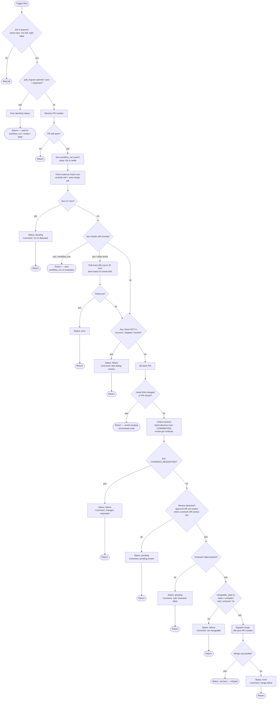

# Auto-merge Workflow

This document reverse-engineers `.github/workflows/auto-merge.yml`: what it
does, how it decides, and which knobs to turn. A portable, parameterized copy
lives in [`templates/workflows/auto-merge.yml`](templates/workflows/auto-merge.yml).

## Overview

A single-job GitHub Actions workflow that **squash-merges a pull request
automatically** once three independent conditions hold:

1. **CI is green** — every external check run for the head commit concluded
   `success`, `skipped`, or `neutral`.
2. **A review happened** — an approval, an inline comment from a non-author, or
   any activity from a recognised review bot (even a rate-limit reply counts).
3. **The `reviewed` label is present** — a deliberate human "I accept this" gate.

All logic lives in one inline [`actions/github-script`][gh-script] step; there is
no external/custom action and no persisted state.

## Triggers

| Event | Action(s) | Role |
|-------|-----------|------|
| `pull_request` | `opened`, `synchronize`, `reopened` | **Fast path** — post a visible `pending` status and return immediately (no polling). |
| `pull_request` | `labeled` | Real evaluation, but only when the label is `reviewed` (gated in `if:`). |
| `pull_request_review` | `submitted` | Re-evaluate when a review lands. |
| `workflow_run` | `completed` | **Primary driver.** Fires when a watched CI workflow finishes, giving a fresh evaluation the moment the last check goes green. |

> **Gotcha:** `workflow_run` triggers are read from the workflow file **as it
> exists on the default branch**. These triggers only take effect for PRs once
> the workflow is merged to `main`.

Watched CI workflows (the `workflow_run.workflows` list): `Tests`,
`Lint (ruff + ty)`, `Nix`, `Contributor Attribution Check`,
`Supply Chain Audit`, `OSV-Scanner`, `Docs Site Checks`, `uv.lock check`.

## Concurrency

```
group: auto-merge-pr-<PR#>-<'fast'|'eval'>
cancel-in-progress: true
```

- The PR number is resolved from whichever of `pull_request`, `issue`, or
  `workflow_run.pull_requests[0]` is present.
- Fast-path events (`synchronize`/`opened`/`reopened`) use a separate `-fast`
  suffix so they **never cancel an in-flight real evaluation**. Real
  evaluations share the `-eval` group, so only the newest one survives.

## Permissions

`pull-requests: write`, `contents: write`, `checks: read`, `statuses: write`,
`issues: read`. Runs with the default `GITHUB_TOKEN`.

## Job gate (`if:`)

The job runs only when:

- `workflow_run` **and** the finished workflow is **not** `Auto-merge`
  (prevents a self-trigger loop), **or**
- `pull_request_review` from a **same-repo** head (forks excluded), **or**
- `pull_request` from a same-repo head — and for `labeled` events, the label
  must be `reviewed`.

Fork PRs are excluded everywhere (they cannot be granted a `write` token).

## Decision flow



## Notable design details

- **`reviewed` label is a hard human gate.** Approved review + green CI is *not*
  enough; someone must add the `reviewed` label to confirm the feedback was
  accepted.
- **Review bots count even when rate-limited.** A hardcoded `REVIEW_BOTS` set
  (Gemini Code Assist, Copilot reviewer / SWE agent, CodeRabbit, Qodo /
  CodiumAI) satisfies "review activity" on *any* comment or review — explicitly
  including quota / rate-limit error replies ("the attempted review counts").
- **`reviewDetected` is an OR of three signals:** ≥1 `APPROVED` review, OR ≥1
  inline review comment from a non-author, OR ≥1 comment/review from a review
  bot.
- **Reviewer state follows GitHub's resolution.** When computing each
  reviewer's latest state, only `APPROVED` / `CHANGES_REQUESTED` / `DISMISSED`
  reviews count — a later `COMMENTED` review does **not** erase an existing
  approval or `CHANGES_REQUESTED` block (which would otherwise let a block be
  bypassed). Bot-activity detection still scans the full review list, so a bot's
  `COMMENTED` review keeps counting as review activity.
- **Visible `auto-merge` commit status.** Posted to the head SHA with a stable
  context, so reposts update in place and the status shows in the PR check list
  (`pending` → `success`/`failure`/`error`).
- **Idempotent comments.** `upsertComment` locates an existing comment by a
  hidden HTML marker (e.g. `<!-- auto-merge-fail -->`) and edits it instead of
  posting duplicates.
- **No-poll philosophy for CI.** `workflow_run: completed` events re-evaluate as
  each CI workflow finishes; only review/label events poll, because
  those don't receive a CI-completion event. The poll also **aborts early** the
  moment any check reports a failing conclusion, rather than waiting out the
  full timeout.
- **`unstable` is tolerated at merge time.** The workflow's own non-required
  `auto-merge` status may still read `pending` from an earlier run, which makes
  GitHub report `mergeable_state: unstable`. Since every real condition was
  already verified, merging under `unstable` is safe; `dirty`, `behind`,
  `blocked`, and `has_hooks` remain blocking.
- **Self-trigger guard.** The current run is excluded from check runs by its
  `CURRENT_RUN_ID`, and all runs of the auto-merge job are excluded by name so
  its own `cancelled` runs are never read as failing CI.

## Configuration knobs (at a glance)

| Knob | Where | Default |
|------|-------|---------|
| Required label | script: `hasReviewedLabel` | `reviewed` |
| Watched CI workflows | `on.workflow_run.workflows` | 8 workflows (see above) |
| Review-bot logins | script: `REVIEW_BOTS` | Gemini / Copilot / CodeRabbit / Qodo |
| Merge method | `pulls.merge` call | `squash` |
| Poll interval / timeout | script constants | 60s / 25 min |
| `mergeable_state` retries | script loop | 3 × 15s |

[gh-script]: https://github.com/actions/github-script
